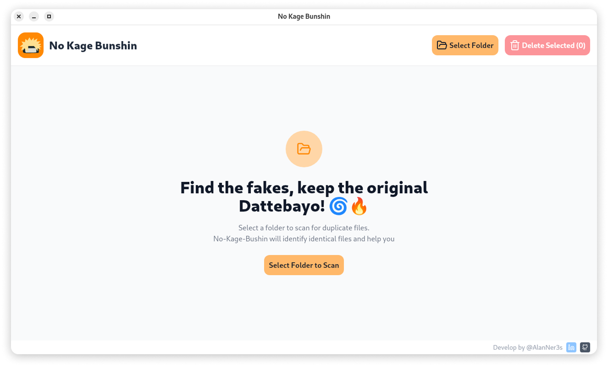

<br>
<div align="center">
  
  <h1 align="center">No Kage Bunshin</h1>
  <p align="center"><strong>No Kage Bunshin é um software de remoção de arquivos duplicados</strong></p>
  <br>
  
</div>

## Visão Geral

No Kage Bunshin é uma ferramenta que ajuda os usuários a encontrar e gerenciar arquivos duplicados em seu sistema. A aplicação permite:

- Selecionar pastas para análise
- Detectar arquivos duplicados (clones)
- Visualizar detalhes dos arquivos duplicados
- Excluir os arquivos duplicados de forma segura (movendo para a lixeira) ou permanente

## Arquitetura

O projeto segue princípios de Clean Architecture:

### Backend (Go)

- **Domain**: Contém as entidades do negócio, interfaces de repositórios e serviços
- **Application**: Implementa os casos de uso da aplicação
- **Infrastructure**: Fornece implementações concretas dos repositórios e serviços
- **Interfaces**: Expõe as funcionalidades através de handlers

### Frontend (React + TypeScript)

- **Components**: Componentes React organizados por tipo (containers, layouts, UI)
- **Contexts**: Gerenciamento de estado global
- **Hooks**: Lógica reutilizável
- **Pages**: Páginas da aplicação
- **Utils**: Adaptadores e utilitários

## Padrões de Design Utilizados

- **Adapter Pattern**: Utilizado para adaptar a comunicação entre frontend e backend
- **Repository Pattern**: Abstração para acesso a dados
- **Dependency Injection**: Implementação de injeção de dependências para facilitar testes
- **Clean Architecture**: Separação clara de responsabilidades

## Pré-requisitos

- Go 1.18+
- Node.js 16+
- Wails CLI

## Como executar

1. Clone o repositório
2. Instale as dependências do frontend:
```
cd frontend && npm install
```
3. Execute o projeto em modo de desenvolvimento:
```
wails dev
```

## Como compilar

Para compilar a aplicação:
```
wails build
```

## Contribuições

Contribuições são bem-vindas! Por favor, sinta-se à vontade para enviar pull requests.
Siga as diretrizes de contribuição no arquivo [CONTRIBUTING.md](CONTRIBUTING.md) para garantir que suas alterações estejam em conformidade com os padrões do projeto.
