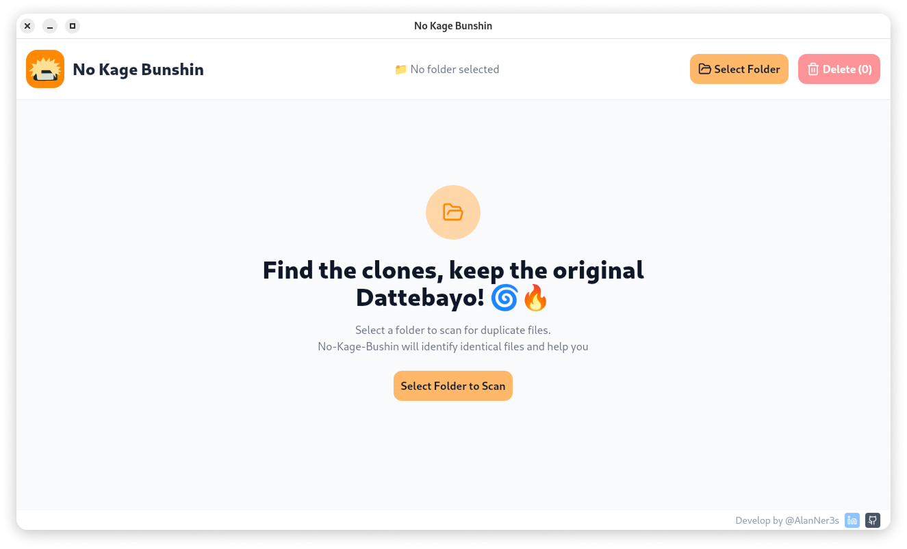

<br>
<div align="center">
  
  <h1 align="center">No Kage Bunshin</h1>
  <p align="center"><strong>No Kage Bunshin é um software de remoção de arquivos duplicados</strong></p>
  <br>
  
</div>

## Visão Geral

**No Kage Bunshin** é um aplicativo desktop desenvolvido com Wails, Go, React e TypeScript, projetado para identificar e gerenciar arquivos duplicados em um sistema. O nome faz referência à técnica de clonagem do anime Naruto ("Kage Bunshin no Jutsu"), aludindo à ideia de encontrar "clones" (arquivos duplicados) e eliminá-los para manter apenas os originais.

## Arquitetura do Sistema

O aplicativo segue uma arquitetura de duas camadas:

- Backend (Go): Responsável pela análise de arquivos, detecção de duplicatas e operações do sistema de arquivos
- Frontend (React/TypeScript): Interface de usuário interativa que permite visualizar e gerenciar os arquivos duplicados

## Recursos

- Listagem de arquivos com informações detalhadas.
- Detecção de arquivos duplicados por conteúdo.
- Identificação de arquivos comprimidos e extração automática para análise. (incompleto)
- Criação de uma pasta temporária para extração e remoção automática após a verificação. (incompleto)

## Implementações Técnicas

### Backend (Go)

- Hash de Arquivos: Implementação eficiente de cálculo de hash SHA-256
- Manipulação do Sistema de Arquivos: APIs nativas do Go para operações em arquivos
- Detecção de Data de Criação: Identificação do arquivo mais antigo entre duplicatas
- Movimentação para Lixeira: Implementações específicas para cada sistema operacional

### Frontend (React/TypeScript)

- Interface Responsiva: Design adaptável com Tailwind CSS
- Gerenciamento de Estado: Contexto React para gerenciar o estado da aplicação
- Navegação: Sistema de rotas para diferentes telas
- Ícones por Tipo de Arquivo: Sistema visual que identifica o tipo de arquivo baseado na extensão

## Desenvolvimento

Para rodar o projeto em modo de desenvolvimento:

```bash
wails dev
```

## Construção

Para criar um pacote de produção:

```bash
wails build
```

Isso gerará um executável redistribuível para o sistema operacional.
